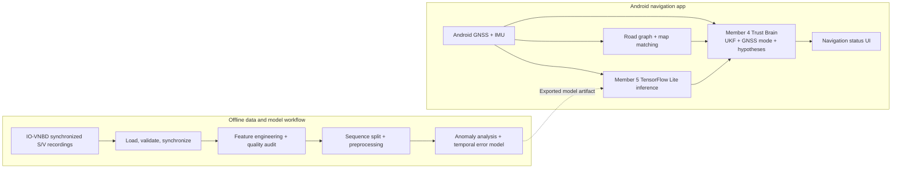

# NAV-SHIELD

**Smartphone-assisted navigation for environments where GNSS can be unreliable**

NAV-SHIELD is a Smart India Hackathon project that brings together Android sensor processing, road-map matching, navigation-state estimation, and an offline data/AI development pipeline. The repository contains both an Android application and Python modules for map matching and sensor-data preparation and analysis.

## Overview

GNSS positions can become noisy or unavailable around tunnels, dense urban areas, and difficult terrain. NAV-SHIELD combines location and motion measurements with road-network context to support a more stable navigation estimate. Its Python pipeline also prepares synchronized vehicle and smartphone recordings for feature analysis and model development.

The codebase is organized as independently testable member modules. The main Android app connects the sensor source, road matcher, AI inference adapter, and Member 4 state estimator through Kotlin contracts.

## Problem and approach

Position estimates based on GNSS alone can jump or degrade when satellite visibility is poor. Smartphone motion sensors provide information between location fixes, while a road graph supplies context about plausible vehicle movement.

NAV-SHIELD processes these sources through separate components: Android collects location and IMU observations, map-matching components score nearby road candidates, the Trust Brain estimates navigation state, and the Member 5 pipeline prepares and analyzes recorded sensor/vehicle data. Component contracts keep the data boundaries explicit.

## Components

| Component | Location | Main responsibilities |
| --- | --- | --- |
| Android navigation app | [`app/`](app/) | Android location and sensor collection, road graph storage/matching, pipeline orchestration, navigation-state display |
| Member 1 — map intelligence | [`NAV_SHIELD_Member1_Module/nav_shield_member1/`](NAV_SHIELD_Member1_Module/nav_shield_member1/) | Road graph construction, spatial indexing, candidate scoring, learned re-ranking, multi-candidate map-match results |
| Member 3 — IMU prototype | [`Member_3/Nav_Shield_1/`](Member_3/Nav_Shield_1/) | Accelerometer/gyroscope filtering and calibration, orientation, phone-to-vehicle alignment, dead reckoning, motion classification, confidence diagnostics |
| Member 4 — Trust Brain | [`app/src/main/java/com/navshield/map/engine/`](app/src/main/java/com/navshield/map/engine/) | UKF-based state estimation, GNSS mode handling, multiple road hypotheses, sensor/map/AI weighting |
| Member 5 — data and AI pipeline | [`src/`](src/), [`main.py`](main.py), [`stage3_features.py`](stage3_features.py), [`stage4.py`](stage4.py)–[`stage8.py`](stage8.py) | S/V data loading and synchronization, data-quality checks, feature engineering, dataset preparation, anomaly detection, error-label generation, temporal model training |

Member 3 is maintained as a separate Android prototype. The main app's routing integration is represented by a Kotlin interface, allowing a routing implementation to be connected through that boundary.

## Architecture



The Android app stores road data locally with SQLite. The Python workflow reads local dataset files and writes aligned data, reports, plots, model artifacts, and predictions to the project output directories. The application does not require a project-hosted backend service.

## Android navigation app

The root Gradle project builds the Kotlin application in `app/`. Its main flow is:

1. Request device location permission.
2. Read GNSS location and Android accelerometer, gyroscope, magnetometer, gravity, and rotation-vector measurements.
3. Load the bundled sample road graph into the local road repository.
4. Pass sensor state, map-match results, and available Member 5 predictions into the Member 4 pipeline.
5. Display the estimated latitude, longitude, navigation mode, active road hypothesis, and position confidence.

The app includes a TensorFlow Lite engine configured to load `nav_shield_lstm_stage8.tflite` from Android assets. The model artifact is present at `app/src/main/assets/nav_shield_lstm_stage8.tflite`.

### Android setup and run

Prerequisites: Android Studio, Android SDK 34, and a JDK supported by Android Gradle Plugin 8.2.2 (JDK 17 recommended).

Open the repository root in Android Studio, allow Gradle sync to complete, and run the `app` configuration on an Android device or emulator. Location-based behavior requires location permission; live sensor readings depend on the device hardware.

From Windows PowerShell, build and run unit tests with:

```powershell
.\gradlew.bat assembleDebug
.\gradlew.bat test
```

## Python data and AI workflow

The Member 5 scripts process the IO-VNBD Synchronised V and S Dataset. Supply a local extracted dataset directory when running the data-ingestion or synchronization commands.

### Python environment

From the repository root on Windows:

```powershell
py -m venv .venv
.\.venv\Scripts\Activate.ps1
python -m pip install --upgrade pip
pip install -r requirements.txt
```

The root `requirements.txt` provides the lightweight data-loading and feature-analysis dependencies (`pandas`, `numpy`, `matplotlib`) and `pytest`. Later training scripts also import machine-learning packages such as scikit-learn, joblib, and PyTorch; install the packages required by the stages you intend to run.

### Run the data stages

Run the single-sequence Stage 1 loader, validator, and synchronizer:

```powershell
python main.py --dataset "D:\data\IO-VNBD\Synchronised V and S Dataset" --sequence Vfa01
```

Stage 1 writes an aligned CSV under `data/processed/` and JSON, text, and diagnostic-plot reports under `results/data_reports/`.

The full dataset synchronization entry point is Stage 2:

```powershell
python synchronize.py --dataset "D:\data\IO-VNBD\Synchronised V and S Dataset"
```

It reads the sequence inventory at `results/data_reports/dataset_inventory.csv` and writes aligned files under `results/data/aligned/`. The inventory can be regenerated with `inventory.py` after setting its `DATASET_ROOT` to the local dataset path.

Engineer features and audit them with:

```powershell
python stage3_features.py --input results/data/aligned --output results --window 10
python stage3_5_audit.py --input results/features/categorised --output results/data_reports/stage3_5
```

### Model-development stages

The following scripts are intended to be run in sequence after their input data has been prepared:

| Stage | Script | Purpose |
| --- | --- | --- |
| 4 | `stage4.py` | Split by sequence and fit imputation/scaling on training data |
| 5 | `stage5.py` | Fit an Isolation Forest for unsupervised anomaly/drift detection |
| 6 | `stage6.py` | Analyze test-set anomaly scores and produce reports |
| 7 | `stage7.py` | Generate position- and velocity-error targets from synchronized recordings |
| 8 | `stage8.py` | Train an LSTM to estimate position and velocity error from temporal feature windows |

These scripts use the project’s `data/` and `results/` directory layout. Review path configuration in the relevant script before running on a different machine or dataset. Stage 5 performs unsupervised detection; its anomaly scores should not be interpreted as labeled drift classifications.

## Member 1 map-matching module

The Python map-matching module can be run independently from its directory:

```powershell
cd NAV_SHIELD_Member1_Module\nav_shield_member1
pip install -r requirements.txt
python sample_data\generate_sample_data.py
python map_matching_service.py
python -m pytest test_module.py -v
```

This module builds and indexes a road graph, scores candidate roads using location, heading, and speed, and returns candidate matches. The sample graph is synthetic test/demo data. The module also includes OSM ingestion, MBTiles generation, and a PyTorch Geometric implementation for environments with the required network/tools and dependencies. Its NumPy learned re-ranker supports the self-contained sample workflow.

The Android application separately includes a local SQLite road repository and a basic map-matching engine used by the app pipeline.

## Member 3 IMU prototype

The standalone Android project is under `Member_3/Nav_Shield_1/`. Open that directory as a Gradle project in Android Studio to run the prototype. Its screens expose sensor filtering/calibration, orientation and alignment diagnostics, motion classification, dead-reckoning outputs, and CSV logging. GNSS heading is accepted through the `setGnssHeading(...)` integration interface.

## Project structure

```text
.
├── app/                                  # Main Android navigation app
│   └── src/main/java/com/navshield/map/  # Contracts, sensors, map, UKF, orchestration
├── NAV_SHIELD_Member1_Module/
│   └── nav_shield_member1/                # Python road graph and map-matching module
├── Member_3/
│   └── Nav_Shield_1/                      # Standalone Android IMU prototype
├── src/                                   # Member 5 CSV loading, validation, synchronization
├── tests/                                 # Python Stage 1 and feature/audit tests
├── python_prototype/                      # Member 4 state-estimation simulator
├── data/                                  # Generated ML-ready data and stage outputs
├── results/                               # Reports, plots, models, and predictions
├── docs/                                  # Integration and implementation reports
├── main.py                                # Member 5 Stage 1 entry point
├── synchronize.py                         # Member 5 Stage 2 entry point
├── stage3_features.py                     # Feature engineering
├── stage3_5_audit.py                      # Feature-quality audit
├── stage4.py ... stage8.py                # Model preparation, analysis, and training
├── build.gradle / settings.gradle         # Android root Gradle configuration
└── requirements.txt                       # Core Python data/test dependencies
```

## Data, storage, and configuration

- **Input data:** IO-VNBD synchronized S/V CSV recordings, supplied locally.
- **Android storage:** SQLite road repository initialized from the bundled sample road graph.
- **Python outputs:** generated under `data/` and `results/`; the stages do not overwrite the original recordings.
- **Configuration:** dataset paths are passed to Stage 1/2 commands; `inventory.py` and some later model stages have paths configured in their source files.
- **Network services:** the runtime Android processing path uses device sensors and local road data. OSM ingestion uses the Overpass service when that optional ingestion workflow is run.

## Testing

Run the root Python data-pipeline tests:

```powershell
python -m pytest tests -v
```

Run the Android unit tests:

```powershell
.\gradlew.bat test
```

Run the Member 1 tests from its module directory with the command shown above. The repository also contains Kotlin tests for map matching, contracts, sensor processing, and pipeline behavior. Python Stage 1 tests use synthetic data; they do not require the IO-VNBD dataset.

## Technical decisions and limitations

- S/V records are synchronized by elapsed time rather than row number, and unmatched samples remain identifiable in the output.
- Feature engineering uses trailing windows and sequence-aware preprocessing to avoid using future rows and to keep sequence boundaries intact.
- The anomaly detector is unsupervised because the recorded pipeline does not use verified row-level drift/no-drift labels for Stage 5 classification.
- The Member 1 sample network is synthetic; OSM ingestion and the production PyTorch Geometric path require their respective external tools/dependencies.
- Physical navigation accuracy and model performance depend on the input recordings and deployment environment; evaluate with representative real routes before relying on estimates for navigation.

## Further documentation

- [Member 1 module README](NAV_SHIELD_Member1_Module/nav_shield_member1/README.md)
- [Member 3 module README](Member_3/README.md)
- [Member 4 integration notes](MEMBER4_README.md)
- [Stage 3 feature engineering](STAGE3_README.md)
- [Stage 3.5 feature audit](STAGE3_5_README.md)
- [Integration and implementation reports](docs/)
